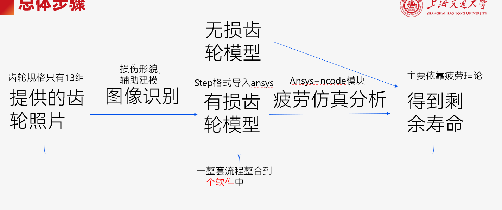

# Gear Damage Analyse 项目运行指南

## 项目简介
这是一个前后端分离的齿轮损伤识别和剩余寿命预测交互页面，前端基于React+Material-UI构建，后端使用Python开发。

## 环境要求
- Python 3.12
- Node.js v22.17.0
- npm 11.4.2

## 项目结构
```
// Directory tree (3 levels)
├── .gitignore
├── README.md
├── data\
│   ├── gear.json
│   └── model\
├── backend\
│   ├── main.py
│   └── requirements.txt
└── frontend\
    ├── README.md
    ├── package-lock.json
    ├── package.json
    ├── public\
    │   ├── index.html
    │   ├── favicon.ico
    │   ├── logo192.png
    │   ├── logo512.png
    │   ├── manifest.json
    │   ├── robots.txt
    │   └── gear.json
    └── src\
        ├── App.css
        ├── App.js
        ├── App.test.js
        ├── AppContext.js
        ├── index.css
        ├── index.js
        ├── logo.svg
        ├── reportWebVitals.js
        ├── setupTests.js
        └── pages\
            ├── ProjectSettings.js
            ├── AIDetection.js
            ├── GeometryModeling.js
            ├── SimulationSettings.js
            └── DataVisualization.js
```

## 后端运行步骤
1. 进入后端目录
    ```bash
    cd backend
    ```
2. 创建并激活虚拟环境
    ```bash
    # 创建虚拟环境
    python -m venv venv

    # Windows激活虚拟环境
    venv\Scripts\activate

    # macOS/Linux激活虚拟环境
    # source venv/bin/activate
    ```
3. 安装依赖
    ```bash
    pip install -r requirements.txt
    ```
4. 启动后端服务
    ```bash
    python main.py
    ```

## 前端运行步骤
1. 进入前端目录
    ```bash
    cd frontend
    ```
2. 安装依赖
    ```bash
    npm install
    ```
3. 启动开发服务器
    ```bash
    npm start
    ```
4. 在浏览器中访问
    ```
    http://localhost:3000
    ```

## 参考资料
- 前后端通信 API 参考：
    - [MDN Web Docs](https://developer.mozilla.org/zh-CN/docs/Web/HTTP/Reference)
- React 样式参考
    - [Ant Design](https://ant-design.antgroup.com/components/overview-cn/)


## 交互页面要求
- 导航栏（顶部或侧边）：项目设置&日志/下载、AI识别、几何建模、仿真设置、数据结果展示

> **需要实现的文件**:
> - backend/
>     - main.py
> - frontend/src/
>     - AppContext.js
>     - pages/
>         - ProjectSettings.js
>         - AIDetection.js
>         - GeometryModeling.js
>         - SimulationSettings.js
>         - DataVisualization.js

### 页面1：项目设置&日志/下载
- 创建项目
    - 输入：
        - 项目名称
        - 项目路径
    - 点击创建项目
- 读取项目
    - 打开项目文件夹
- 项目状态显示：待建模/建模中/待仿照/仿真中/……
- 日志/下载
    - 日志展示
        - 所有页面每个操作重要节点的日志展示
        - 筛选：建模/仿真/识别
    - 点击下载：几何模型、仿真报告、AI预测结果

### 页面2：ai识别
- 输入：
    - 损伤图片：点击上传
        - 支持多张
- 点击开始识别：
    - 调用训练好的模型
        - 先不处理，后端直接pass
- 识别结束后
    - 输出：损伤类型、损伤面积、关联性、热力图
        - 可视化呈现
    - 点击下载：AI预测报告
        - 同步更新到页面1的AI预测报告下载
- 状态显示
    - 同步更新各个页面的状态
- 切换不同页面后仍保留当前项目状态

### 页面3：几何建模
- 输入：
    - 方法一：选择配置（共13组）
        - 选项条目：第几组、主从齿轮的model
        - 从json读入对应的主、从齿轮参数、材料属性、载荷数据
            - [参数](data/gear.json)：
                - 中心距a（mm）
                - 模数mn（mm）
                - 齿数z
                - 变位系数x
                - 螺旋角β（°）
                - 压力角α（°）
                - 齿顶圆da（mm）
                - 齿宽b（mm）
    <!-- - 方法二：手动输入主从齿轮各8个参数
        - 中心距a（mm）
        - 模数mn（mm）
        - 齿数z
        - 变位系数x
        - 螺旋角β（°）
        - 压力角α（°）
        - 齿顶圆da（mm）
        - 齿宽b（mm） -->
- 点击开始建模：
    - 根据上面选择的13组中的某一组，以及前一步识别出来的损伤类型，选择data/model/文件夹下的对应的模型
    <!-- - 调用geartrax（==怎么实现？== -->
- 建模结束后
    - 点击下载：几何模型文件（.STEP ）
        - 同时更新到页面1的几何模型下载
    - 模型展示
- 状态显示
    - 同步更新各个页面的状态
- 切换不同页面后仍保留当前项目状态
    - 即保留输入区参数、几何模型文件、几何模型展示、项目状态

### 页面4：仿真设置
- 输入：
    - 几何建模：
        - 上传
        - 或者用上一步的结果
    - 材料类型（从库中选择）
    - 网格密度（粗 / 中 / 精）
    - 边界条件设置（固定边、加载面）
    - 载荷设置（力、压力、电流等）
- 点击开始仿真
    - 调用 ANSYS Workbench nCode插件进行仿真（==怎么实现？==
        - 暂时无需实现，后端直接pass
- 仿真结束后
    - 点击下载：仿真报告、应力云图
        - 同时更新到页面1的仿真报告下载
    - 仿真模型预览（带边界条件）
- 状态显示
    - 同步更新各个页面的状态
- 切换不同页面后仍保留当前项目状态


### 页面5：综合数据展示页
- 将前面几个页面的内容都展示在这一页面：
    - 项目设置相关：
        - 项目名称、路径、状态
    - 几何建模相关：
        - 几何建模参数、结果
    - 仿真设置相关：
        - 仿真设置参数、结果
    - AI识别相关：
        - 损伤类型、损伤面积、关联性、热力图
- 可视化展示：云图


